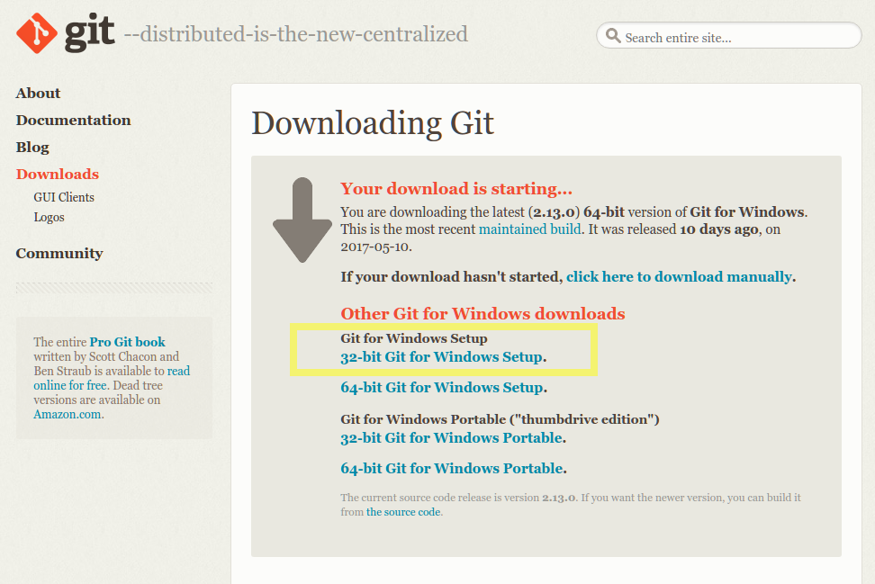
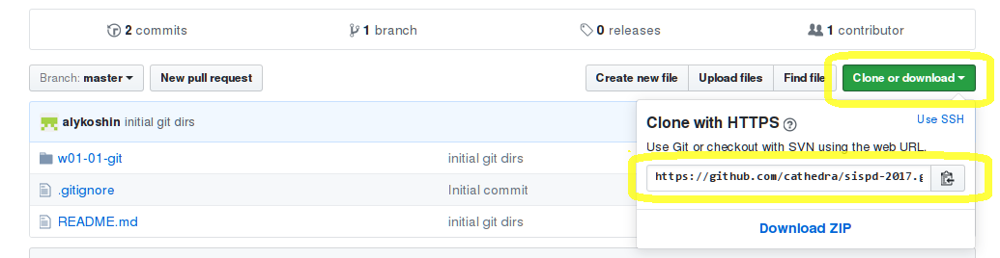
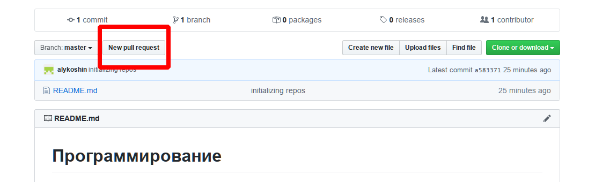
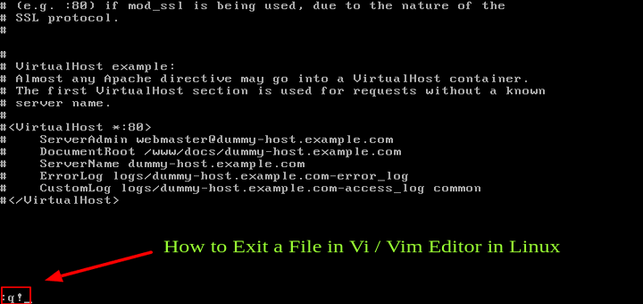

# lab17 01-html

ЗАДАНИЯ
-------
1. Установить Git https://git-scm.com/downloads. Проверьте, какая версия операционной системы установлена на компьютере - 32 или 64 бита
.

2. Создать рабочую папку для проектов, например `c:\projects`:
             

Открыть командную строку, перейти в созданный каталог, например:
```cmd
c:
cd projects
```

Из командной строки с помощью Git клонировать текущий репозиторий на локальный диск командой `git clone <url-репозитория>`.
Параметр URL для этой команды можно посмотреть, нажав на зеленую кнопку _Clone or download_ на странице репозитория на Github.


Для идентификации своих работ нужно использовать первую букву своего имени и полную фамилию на латинице (пример: `alykoshin`)

3. Создайте новую ветку в репозитории Git (`git checkout -b <имя-ветки>`), имя которой состоит из вашего идентификатора и номера задания, разделенных дефисом.

4. В подкаталоге `solutions` создайте подкаталог со своим идентификатором, 
всю дальнейшую работу вести в нем, не забывая делать `git pull`, `git commit` и `git push`. Обратите внимание, что Git не сохранит пустой каталог без файлов.
При необходимости скопируйте исходные файлы задания из `assignments`.

5. **Основное задание**: 
- в своем каталоге создайте файл формата Markdown с именем `README.md`. 
    - Файл должен содержать 
        - заголовок первого уровня - название предмета, 
        - заголовок второго уровня - ваш идентификатор.
        - текст файла - краткий конспект по разметке Markdown в виде списка элементов форматирования и их описания (не более строки на каждый элемент). 
    - Описание разметки Markdown, используемой в Git: [https://guides.github.com/features/mastering-markdown/](https://guides.github.com/features/mastering-markdown/).
- Добавьте файл в репозиторий Git командой `git add`, сделайте `git commit`, затем - `git push` (при необходимости - `git pull`)
- Когда делается `push` новой ветки, которая была создана локально, но еще не существует в удаленном репозитории, необходимы дополнительные параметры: `git push -u origin <имя-ветки>`.

6. Когда работа закончена, сделайте `git merge` ветки `master` в вашу ветку, чтобы добавить в нее последние модификации `master`, сделайте `git push`, затем создайте _Pull Request_ - запрос на слияние вашей ветки с основной веткой репозитория `master`. 
. Преподаватель проверит правильность выполнения задания и примет 


ПРИМЕЧАНИЯ
==========

Сохранение в удаленном репозитории командой `git push` возвращает ошибку:
-------------------------------------------------------------------------
> ```
> ! [rejected]        master -> master (fetch first)
> error: failed to push some refs to 'https://github.com/DuudeXX8/TripBaku-.git'
> hint: Updates were rejected because the remote contains work that you do
> hint: not have locally. This is usually caused by another repository pushing
> hint: to the same ref. You may want to first integrate the remote changes
> hint: (e.g., 'git pull ...') before pushing again.
> hint: See the 'Note about fast-forwards' in 'git push --help' for details.
> ```                                                                                                          

Это значит, что в репозиторий были внесены изменения другим пользователем, и требуется их подгрузить командой `git pull` (подсказка содержится в сообщении об ошибке).


Редакторы `vi` и `vim`
----------------------

В зависимости от настроек Git по умолчанию в операционных системах Linux/MaxOS вызываться текстовый редактор `vi` или `vim`, управление которыми поначалу неочевидно.
Вызов редактора по умолчанию обычно происходит, если вы не ввели сообщения для коммита. 



Для того, чтобы выйти из этого редактора, необходимо перейти в командный режим, нажав кнопку `ESC`, затем ввести одну из следующих команд:

Команда     | Описание        
------------|--------------------------------------------------------------------------
`:q`         | Выход (если не было изменений файла)
`:q!`        | Выход без сохранения изменений файла
`:wq`        | Сохранить изменения файла и выйти

Изменить редактор, используемый Git по умолчанию, можно командой (в данном случае на редактор `nano` - перед вводом этой команды убедитесь, что редактор в вашей системе установлен):
```
git config --global core.editor "nano"
```                   


Вход под другим пользователем для Git командной строки
------------------------------------------------------

Если на данном компьютере другой пользователь уже работал с Git из командной строки, информация об его учетной записи сохранена и более не запрашивается.

Чтобы зайти под другим пользователем, информацию о предыдущем необходимо удалить из хранилища. 

Для этого нужно открыть `Панель управления` -> `Учетные записи пользователей` -> `Администрирование учетных записей Windows`. В разделе `Общие учетные данные` для записи с именем `git:https://github.com` кликнуть на иконке выпадающего списка и далее кликнуть на ссылке `Удаление из хранилища`. Подтвердить удаление.

После этого при операциях с репозиторием, требующих авторизации, будет запрошено имя пользователя и его пароль.


КОМАНДНАЯ СТРОКА WINDOWS
------------------------

Git, устанавливаемый под Windows, может работать, как из стандартной командной строки `cmd`, так и из командной строки `bash`.


Windows     | Unix        | Описание        
------------|-------------|--------------------------------------------------------------------------
`cd`        | `pwd`       | Вывести текущий путь к текущему каталогу
`cd <path>` | `cd <path>` | Перейти к каталогу, находящемуся по пути <path>
`dir`       | `ls`        | Вывести содержимое текущего каталога
------------|-------------|--------------------------------------------------------------------------
`\`         | `/`         | Разделитель каталогов в пути (т.е. `c:\Users\user\` или `/home/user`)

Чтобы указать текущий путь: `.`, путь к каталогу на уровень выше: `..`, на два уровня выше - `../..'

Чтобы запустить исполняемый файл из текущего каталога, в Unix необходимо указать явно путь, например: `./node[.exe]`.
При запуске исполняемого файла `Windows` сначала ищет его в текущем каталоге, затем - в каталогах, заданных переменной окружения `%PATH%.
`Unix` ищет только по каталогам, заданных в `$PATH`, поэтому чтобы запустить исполняемый файл из текущего каталога, 
в Unix необходимо указать явно путь, например: `./node[.exe]`.


ТИПОВОЙ ЦИКЛ РАБОТЫ С GIT
-------------------------
Команда                          | Описание
---------------------------------|-------------------------------------------------------------
`git clone <url>`                | Создать локальную копию центрального репозитория
<работа с файлами репозитория>   |
`git status`                     | Просмотреть состояние
`git checkout <branch-name>`     | Переключиться на существующую ветку
`git checkout -b <branch-name>`  | Создать новую ветку и переключиться на неё
`git add <pathname>`             | Пометить файл(ы) для сохранения
`git commit -m "commit message"` | Сохранить в локальном репозитории
`git push`                       | Сохранить изменения из локального репозитория в центральный
                                 | Если в центральный репозиторий были внесены изменения другим пользователем,
                                 | их необходимо объединить с локальной версией командой `pull` (см.ниже)
---------------------------------|-------------------------------------------------------------
`git pull`                       | Получить изменения из центрального репозитория и объединить их с локальным/
                                 | Если при объединении окажется, что разные пользователи внесли изменения 
                                 | в одно и то же место одного и того же файла, файл необходимо будет отредактировать
                                 | и пометить для сохранения
---------------------------------|-------------------------------------------------------------

